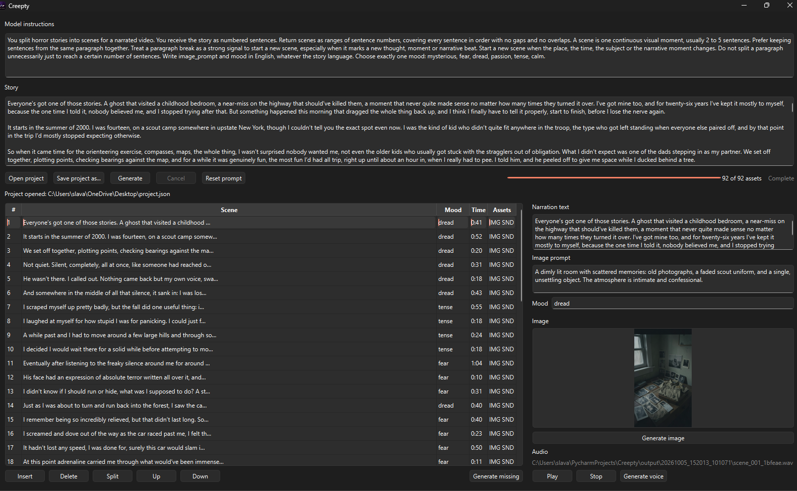

# Creepty

Creepty is a fully local AI desktop application that transforms written stories into editable visual scenes with generated images and narration.

All AI inference runs locally using Ollama, ComfyUI and Qwen3-TTS — no external AI APIs required.



## Key Features

- Fully local AI inference
- Automatic LLM-based scene segmentation
- AI image generation with ComfyUI
- Local narration with Qwen3-TTS
- Editable and persistent projects
- GPU/VRAM-aware model orchestration
- Cancellation, retries and error recovery
- Regression tests and benchmarking tools

## Architecture

Story  
↓  
Ollama / Gemma  
↓  
Scene Planning  
↓  
ComfyUI / FLUX  
↓  
Images  
↓  
Qwen3-TTS  
↓  
Narrated Project

## Current stack

| Component | Implementation |
|---|---|
| Desktop interface | Python 3.12 and PySide6 |
| Scene planning and image prompts | Ollama with Gemma 4 E4B (`gemma4:e4b`) |
| Images | ComfyUI with FLUX.2 Klein 4B FP8 |
| Narration | Qwen3-TTS 1.7B CustomVoice, English, Ryan |
| Voice execution | CUDA, BF16 main model, FP32 waveform decoder, and PyTorch SDPA |
| Output formats | PNG images and PCM-16 WAV audio at 24 kHz |

The current image workflow generates 768 × 1344 images with 4 steps, the Euler sampler, and CFG 1. Narration uses the same speaker throughout a story, with mood instructions controlling delivery.

## Requirements

- Windows with Python 3.12 and the `py` launcher.
- An NVIDIA GPU with BF16 support and a compatible NVIDIA driver. The current pipeline has been validated on an RTX 4060 Ti with 8 GB of VRAM and a system with 32 GB of RAM; these are the tested specifications, not established minimum requirements.
- Git and `curl` available on `PATH`.
- `winget` if Ollama is not already installed.
- Internet access and disk space for the initial dependency and model downloads.

Narration requires CUDA and does not silently fall back to the CPU.

## Installation and launch

Run these commands in PowerShell from the project root:

```powershell
.\setup.bat
.\.venv\Scripts\python.exe app.py
```

The setup script:

1. Creates the application's `.venv` and installs its dependencies, including the validated PyTorch 2.3.1 CUDA 12.1 build.
2. Downloads the Qwen narrator weights without loading the model into memory.
3. Installs Ollama if needed and pulls `gemma4:e4b`.
4. Installs or updates ComfyUI and downloads the image model, text encoder, and VAE.

ComfyUI uses its own virtual environment and CUDA 12.8 PyTorch wheels. Its default installation directory is `C:\AI\ComfyUI`. To use another directory, set `CREEPTY_COMFY_DIR` before both setup and launch:

```powershell
$env:CREEPTY_COMFY_DIR = 'D:\AI\ComfyUI'
.\setup.bat
.\.venv\Scripts\python.exe app.py
```

This PowerShell setting applies to the current session. Use the same value whenever launching the application from a new session.

Ollama must be running when pulling the model and generating scenes. Creepty starts ComfyUI automatically when needed, or reuses an existing instance at `http://127.0.0.1:8188`. Changing `CREEPTY_COMFY_DIR` changes the installation path, not the API address.

The root `setup.bat` calls `setup_qwen-tts.bat`, `setup_ollama.bat`, and `setup_comfyui.bat` directly. The Qwen installer creates the application environment and installs its dependencies as well as the narrator weights; there is no intermediate application setup wrapper.

ComfyUI setup stops on environment, dependency, or model download failures. Downloads use temporary `.part` files and are published only after a successful, nonempty download. Existing empty model files are downloaded again.

To update only the application environment and narrator dependencies:

```powershell
.\scripts\setup_qwen-tts.bat
```

## Using Creepty

1. Paste a story and optionally edit the model instructions.
2. Click **Generate** to plan scenes, generate all images, and then generate narration.
3. Select a scene to inspect its text, image prompt, mood, image, and audio.
4. Edit scenes as needed. Use **Insert**, **Delete**, **Split**, **Up**, and **Down** to organize them.
5. Use **Generate image** or **Generate voice** to regenerate the selected scene's asset, or **Generate missing** to fill assets that do not exist yet.

Changing narration text or mood marks both assets for regeneration. Changing only the image prompt marks only the image. **Generate missing** also detects files removed from disk. Old generated files remain on disk; edits do not delete them. Scene editing is disabled during generation, and results carry a scene identifier and revision to prevent late results from attaching to changed text.

**Open project** restores a saved scene list. **Save project as...** chooses a manifest location; subsequent edits are saved there automatically. New projects autosave to `output/<run_id>/project.json` after scene batches, completed assets, and edits (with a short typing debounce). Reopen that file after restarting to resume with **Generate missing**. Project JSON includes source story, model instructions, ordered scenes, asset paths, and measured narration duration. The **Time** column shows measured audio duration when available and a `~` estimate otherwise.

Project files reference media rather than embedding it. Keep the asset folders when moving or sharing a project; relative paths are used where possible. Opening a project validates media, recalculates WAV duration, and marks missing, corrupt, or silent assets for regeneration. Older output folders without a project manifest cannot restore the original editable scene list automatically.

Supported narration moods are `mysterious`, `fear`, `dread`, `passion`, `tense`, and `calm`. Common synonyms and older free-form mood strings map to the first recognized mood word; unknown moods use `calm`. Gemma is instructed to return one supported mood.

Narration is currently configured for English with the Ryan voice. Language and speaker settings are defined in the code rather than selected in the interface.

**Cancel** stops the submitted image job or prevents subsequent work. An active scene-planning or narration call may need to finish before cancellation takes effect. Closing the window requests cancellation and keeps the event loop alive until the worker and GPU cleanup finish. Ollama calls use a 5-second connection timeout and 180-second read timeout (30 seconds for unloading). These are network timeouts, not a hard deadline for GPU inference.

## GPU execution and memory management

The pipeline runs in a worker thread to keep the interface responsive. Models use the GPU in sequential phases so image and voice workloads do not compete for the same VRAM:

1. **Scene planning:** Gemma stays loaded across batches of the same story, with a stable context size unless a capacity error requires reducing it. It is unloaded when planning finishes or the iterator closes. Malformed or truncated scene responses retry in smaller sentence batches, with at most three attempts at each unfinished position. Retries resume from unfinished text without duplicating completed scenes; failed planning stops before asset generation.
2. **Images:** ComfyUI renders the image batch with the current workflow. An image-only batch can leave ComfyUI loaded to speed up subsequent image regeneration.
3. **Narration:** Creepty releases ComfyUI's GPU memory before loading Qwen. The narrator is reused across scenes in the batch, then unloaded and its CUDA cache released.

Before a new story or narration batch, the application releases models from the previous phase. If Creepty started ComfyUI, it stops that process when switching phases. An externally started ComfyUI instance remains running: Creepty requires an idle queue, requests model unloading through `/free`, and checks memory availability before continuing. Keep that instance idle from other clients while Creepty is generating content.

Narration keeps your FP32 waveform decoder fix while the main model stays in BF16. Before publishing a WAV, Creepty checks for finite samples, at least 0.1 seconds of audio, a meaningful non-flat signal, and amplitudes outside the PCM range. Invalid generated signals get one retry; repeated failure is reported instead of saving a silent track. WAVs are written atomically and checked after PCM encoding. These checks do not establish intelligibility or artistic quality. Number normalization preserves commas and sentence punctuation, handles grouped numbers, ranges, and decimal digits, and expands clock times.

Qwen reuses complete local model snapshots to avoid repeated metadata requests. Incomplete cached downloads are completed before loading the model.

## Outputs and configuration

Generated assets are saved under `output/<run_id>/`, using names such as `scene_001_<suffix>.png` and `scene_001_<suffix>.wav`. Regeneration creates new filenames. The project manifest preserves the editable scene list across sessions. Atomic manifest replacement protects the previous saved version if a save fails; save failures appear in the status line.

| File | Purpose |
|---|---|
| [app.py](app.py) | Desktop interface, project controls, and coordinated shutdown |
| [pipeline/workers.py](pipeline/workers.py) | GPU pipeline orchestration and immutable job snapshots |
| [pipeline/scenes.py](pipeline/scenes.py) | Scene identity, revisions, and asset invalidation |
| [pipeline/project.py](pipeline/project.py) | Versioned project manifests and media recovery |
| [pipeline/audio_validation.py](pipeline/audio_validation.py) | Shared audio signal validation |
| [pipeline/moods.py](pipeline/moods.py) | Shared mood vocabulary and normalization |
| [pipeline/segmenter.py](pipeline/segmenter.py) | Default instructions, Ollama model, bounded requests, and scene batching |
| [pipeline/images.py](pipeline/images.py) | ComfyUI requests, shared image style, and output handling |
| [pipeline/workflows/image.json](pipeline/workflows/image.json) | Image workflow, models, resolution, sampler, and step count |
| [pipeline/voice.py](pipeline/voice.py) | Narrator, language, mood instructions, and voice sampling settings |
| [pipeline/comfy_server.py](pipeline/comfy_server.py) | ComfyUI process lifecycle and GPU memory handoff |
| [requirements.txt](requirements.txt) | Application dependencies |
| [benchmarks/](benchmarks/) | Measurement runners, report generation, and benchmark dependencies |
| [scripts/](scripts/) | Environment and model installation scripts |

Custom image workflows must use ComfyUI's API export format and contain the literal `{{PROMPT}}` placeholder. Restart Creepty after editing the workflow because its template is cached.

## Benchmarks

Benchmark source lives in `benchmarks/`, separately from the installation scripts in `scripts/`. Results are written to `output/benchmarks/`.

### Preparation

Complete the application setup first, then install the additional benchmark dependencies:

```powershell
.\.venv\Scripts\python.exe -m pip install -r benchmarks\requirements.txt
```

Run benchmarks while Creepty and other model workloads are idle. They need the same CUDA/BF16-capable GPU and downloaded models as the application, including when comparing CPU narration. Qwen runs offline during measurements, so its complete weights must already be cached. Ollama must be running for prompt measurements. The image benchmark starts its own ComfyUI instance on port **8189**, using `CREEPTY_COMFY_DIR`; leave that port free.

### Run the pipeline comparison

```powershell
.\.venv\Scripts\python.exe -B -u benchmarks\benchmark_pipeline.py
```

This measures Ollama with unloading versus keeping the model resident, then generates three fixed scenes under each asset profile:

| Profile | Execution |
|---|---|
| `sequential_cpu` | GPU images, followed by CPU/FP32 narration |
| `sequential_gpu` | GPU images, ComfyUI shutdown, then GPU/BF16 narration |
| `parallel_cpu` | GPU images and CPU/FP32 narration at the same time |

To measure only the GPU asset pipeline and skip Ollama:

```powershell
.\.venv\Scripts\python.exe -B -u benchmarks\benchmark_pipeline.py --skip-llm --profiles sequential_gpu
```

`--profiles` accepts one or more profile names. `--skip-llm` omits prompt measurements. An already resident Ollama model also causes that stage to be skipped; unload it before benchmarking to avoid competing GPU workloads.

### Measure isolated narration

```powershell
.\.venv\Scripts\python.exe -B -u benchmarks\benchmark_resume.py --skip-llm
```

This starts a **new** run: isolated GPU narration, isolated CPU narration, and then a parallel image/CPU-voice profile if isolated CPU generation succeeded. It does not resume a previous run. Omit `--skip-llm` to include the Ollama comparison.

### Generate a report from existing runs

Each measurement command prints its output directory. Replace the example directory placeholders below with those printed paths:

```powershell
.\.venv\Scripts\python.exe -B benchmarks\benchmark_finish.py --pipeline-run '.\output\benchmarks\<pipeline-run>' --voice-run '.\output\benchmarks\<voice-run>'
```

`--voice-run` is optional. This command reads existing results without loading models or repeating measurements. It writes an English `report.md`, `consolidated.json`, and `voice_samples.csv` to a new `output/benchmarks/report_<timestamp>/` directory. Inputs with conflicting scene, seed, or workflow metadata are rejected; still check model and package versions before comparing different runs.

All three commands support `--help` without starting a benchmark.

### Read the results

- `manifest.json`: fixed scenes and seeds, dependency versions, workflow hash, and system memory information.
- `summary.json`: profile results; the pipeline runner records `complete` for each profile and returns a nonzero exit code if any selected asset profile fails.
- `llm.json`: prompt responses, context size, and Ollama timing information, when that stage completed.
- Per-profile `images.json`, `voice_cpu.json` or `voice_gpu.json`: asset timings, output paths, hashes, and audio checks.
- Per-profile logs and `*_resources.json`: diagnostic output and CPU, RAM, GPU, and VRAM samples.

A voice worker has a 900-second timeout and stops if available system RAM falls below 700 MiB. Inspect logs and completion status before using timings; failed or partial attempts are not valid completion times. An omitted or failed Ollama stage is recorded separately and does not determine the asset runner's exit code.

Each profile uses three different scenes in one pass, rather than repeated trials of the same scene. Resource samples include other system processes. CPU and GPU voice outputs may differ despite fixed seeds; audio and pixel checks do not replace listening to the narration and inspecting the images.

## Validation

Run the regression tests from the project root:

```powershell
.\.venv\Scripts\python.exe -B -m unittest discover -s tests -v
```

The regression tests use mocked services and model loading, real temporary media/project files, and an offscreen Qt event loop. They cover GPU phase ordering, cancellation, memory release, FP32 decoder placement, silent/invalid audio, punctuation, scene retries, asset invalidation, project recovery, atomic saves, and closing during active work without running model inference. Windows installer tests exercise success and failure paths with local command stubs and no downloads.

An earlier GPU implementation was also validated on 4 October 2026 with a complete generation, image regeneration, and voice regeneration. The run confirmed CUDA/BF16/SDPA narration, 768 × 1344 images, valid 24 kHz WAV files, and model cleanup between phases.

Local benchmark reports and samples are stored in `output/benchmarks/`; implementation validation reports and samples are in `output/validation/`. The entire `output/` directory is ignored by Git, so these artifacts are not included in a fresh checkout. Timings are specific to the tested machine and workload.

## License

This project is licensed under the Apache License 2.0. See the [LICENSE](LICENSE) file for details.
